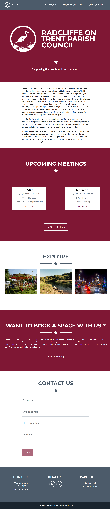
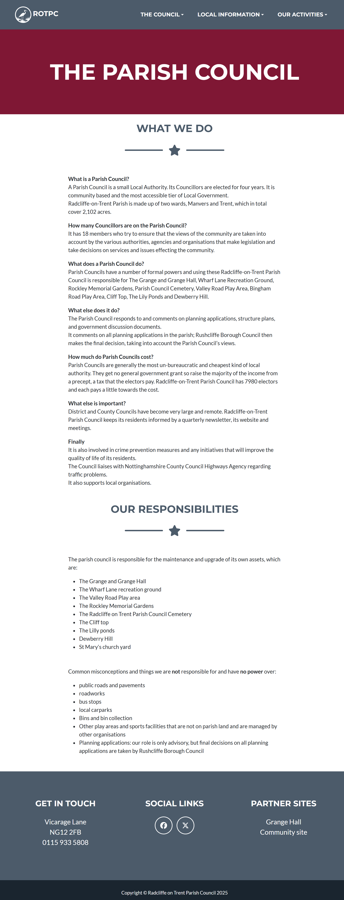
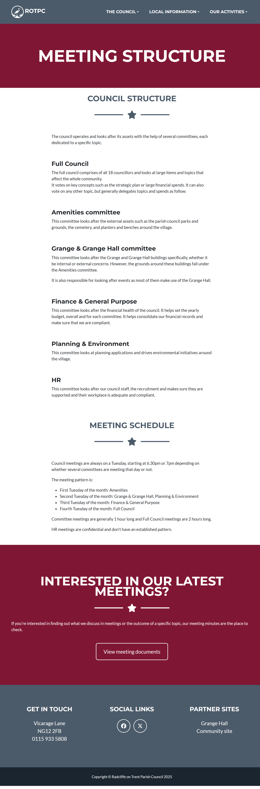
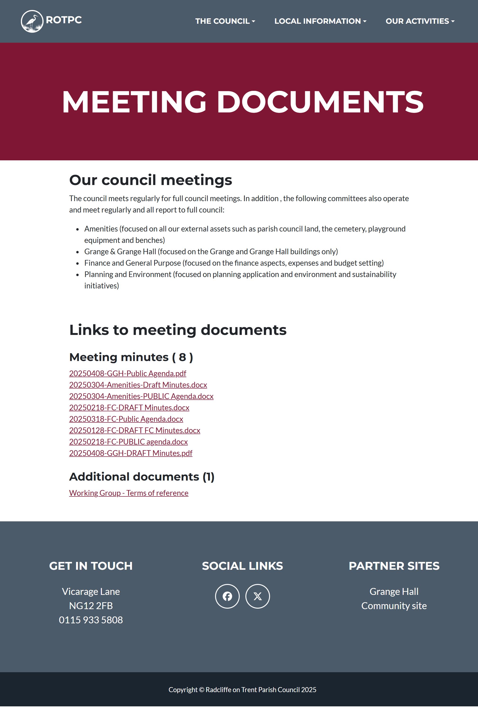
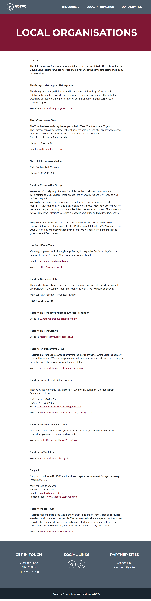
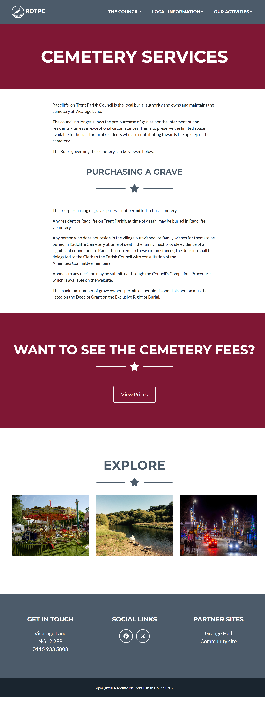
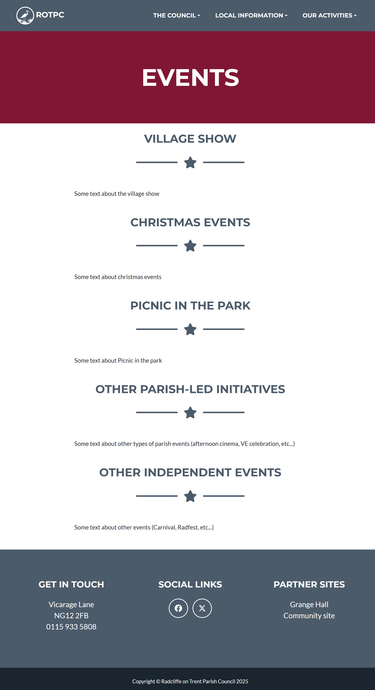
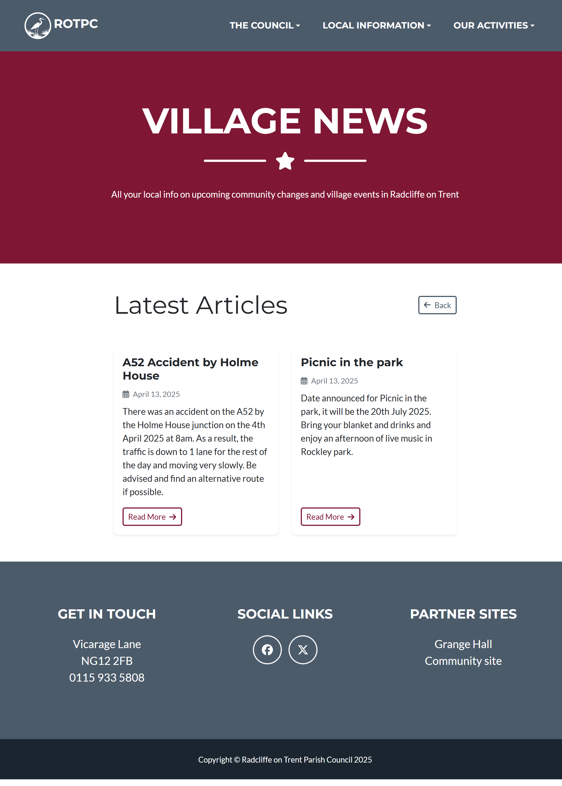
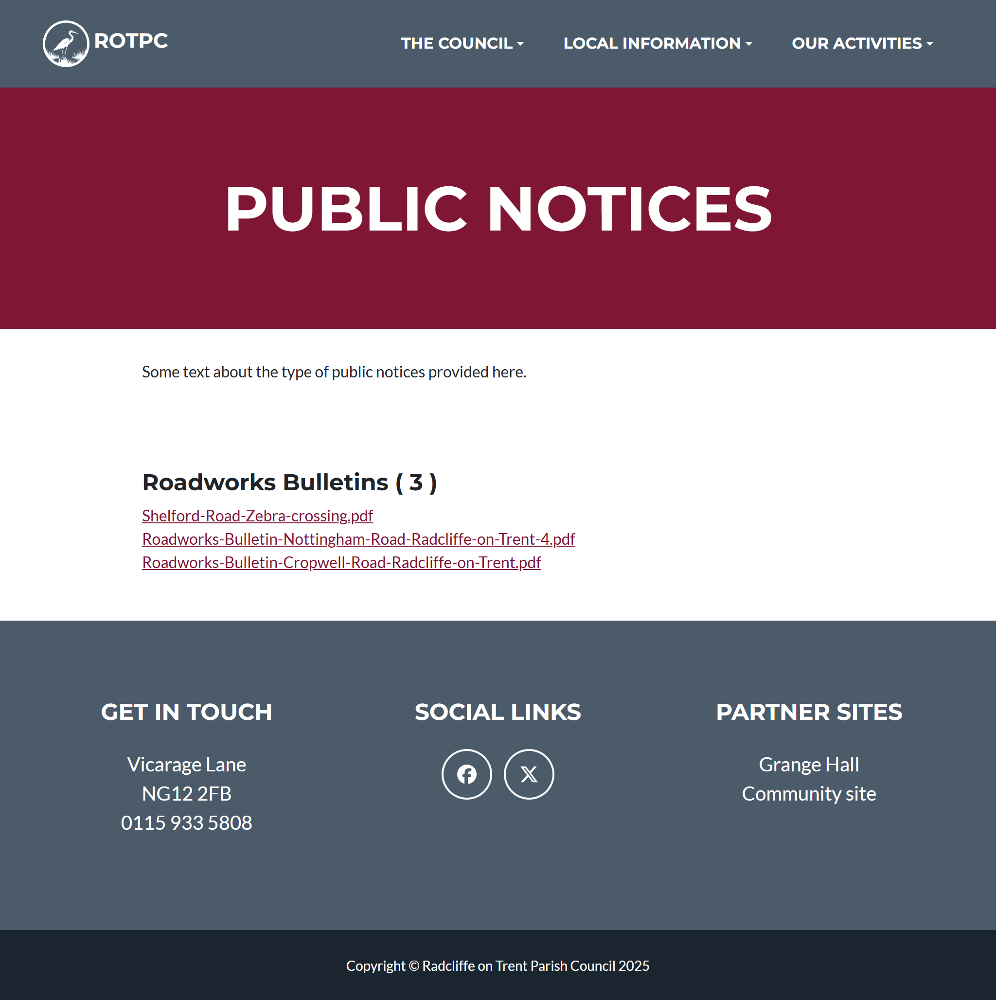

# ROTPC website prototype

## Pages screenshots

### Menu sections

Landing Page / Home page

The council

The council - Responsibilities

The council - Assets

The council - Councillors

The council - Meeting Schedule

The council - Meeting documents

The council - Policies

Local information

Local information - Village History

Local information - Community groups

Local information - RoT Cemetery

Our activities

Activities/News corner - Events

Activities/News corner - Village news

Activities/News corner - Parish news

Activities/News corner - Public notices

